# ITAlumni — Kickoff

## Overview

ITAlumni (Kickoff) is a front-end project scaffolded with TypeScript and Vite. It implements a responsive web interface for job listings, user networking, and profile interactions, organized for desktop and mobile views.

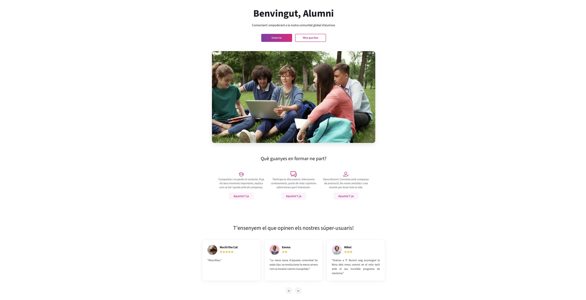

## Features

- **Responsive UI:** Separate desktop and mobile layouts with modular components.
- **Data-driven pages:** Jobs and users are loaded from JSON in `data/` for prototyping.
- **Modular architecture:** Components are organized under `src/components/` and pages under `src/pages/`.

## Tech Stack

- **Language:** TypeScript
- **Bundler / Dev server:** Vite
- **Styling:** CSS (styles split into `styles/desktop/`, `styles/mobile/`, and `styles/global/`)

## Getting Started

### Prerequisites

Node.js (v16+ recommended) and npm.

### Installation

Install dependencies:

```bash
npm install
```

### Running the Development Server

```bash
npm run dev
```

### Building for Production

```bash
npm run build
```

### Preview Production Build Locally

```bash
npm run preview
```

## Available Scripts

- **dev:** Starts Vite dev server (`npm run dev`).
- **build:** Compiles TypeScript and builds with Vite (`npm run build`).
- **preview:** Serves the production build locally (`npm run preview`).

## Project Structure

### Key Files

- **`index.html`**: App entry HTML.
- **`src/main.ts`**: App bootstrapping and initialization.
- **`src/pages/`**: Page-level modules for desktop and mobile versions (e.g., `pages/desktop/Home.ts`, `pages/mobile/mobileHome.ts`).
- **`src/components/`**: Reusable UI pieces and class models (`Job.ts`, `User.ts`, filters, navigation, headers, footers).
- **`src/data/`**: Mock data used by the app (`jobs.json`, `users.json`).
- **`styles/`**: CSS split by target (`styles/desktop/`, `styles/mobile/`, `styles/global/`).
- **`public/`**: Static assets such as images, icons, and videos.

## Screenshots

### Desktop Version

**Home Page**  
The landing page with hero section, benefits, and user testimonials.


**Navigation Bar**  
Top navigation with logo and links.


**Jobs Listing**  
Browse and filter available job opportunities.

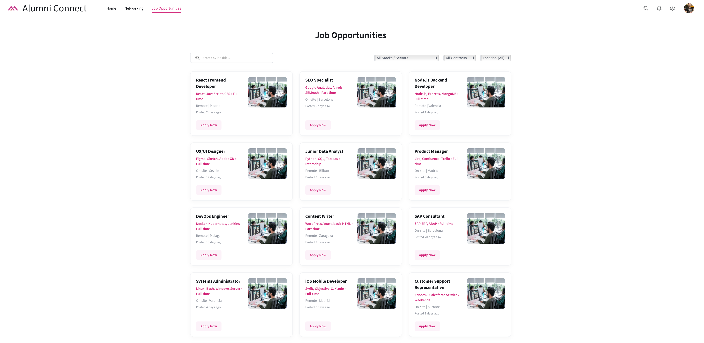

**Networking Page**  
Connect with other professionals and explore user profiles.

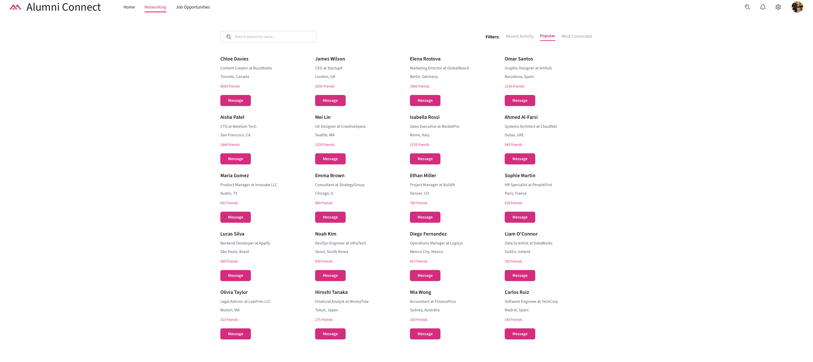

**Login Page**  
User authentication interface.

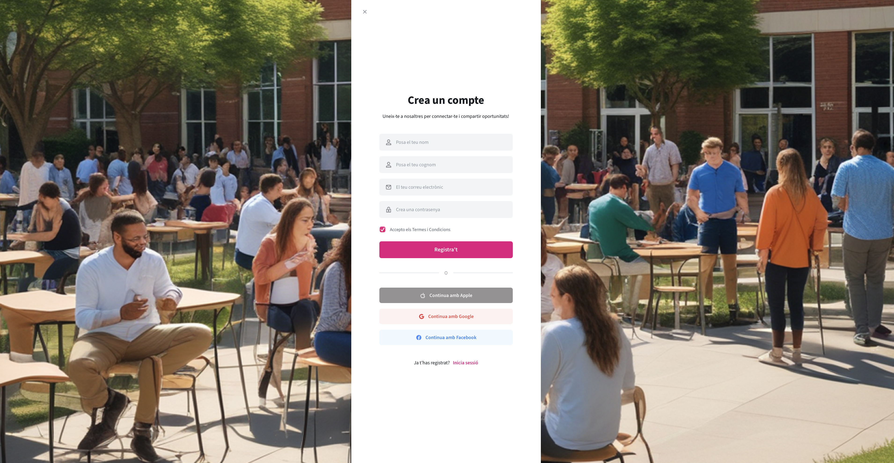

**Footer**  
Application footer with additional links and information.

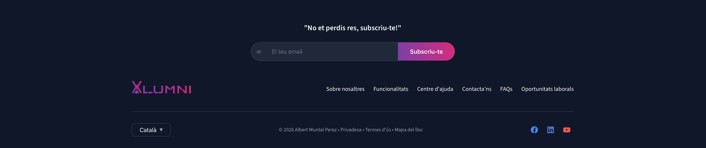

### Mobile Version

**Splash Screen**  
Initial loading screen for mobile devices.

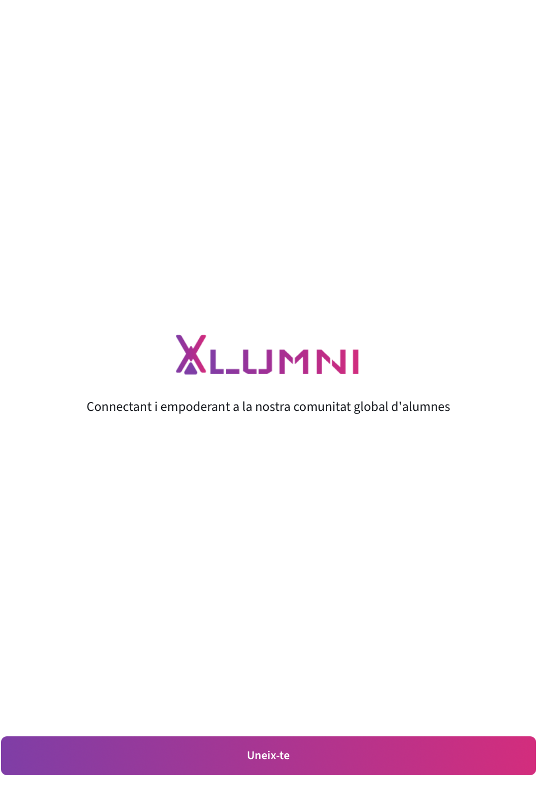

**Home Page**  
Responsive home page optimized for mobile screens.

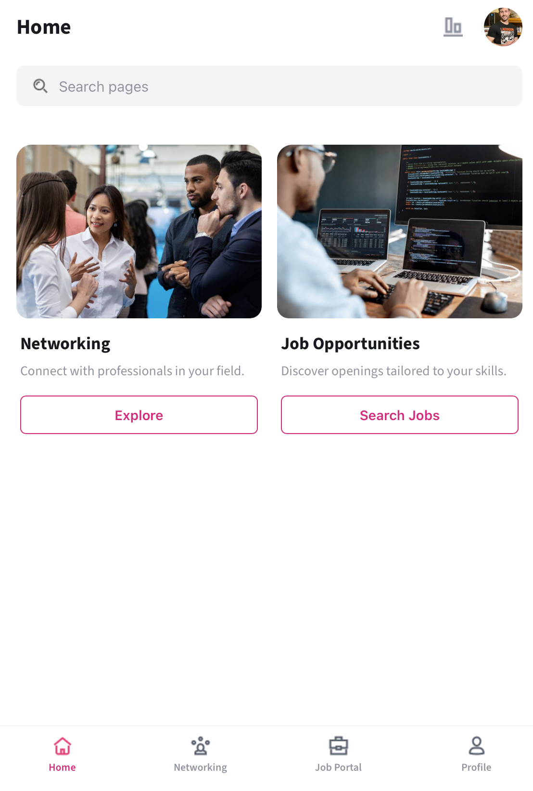

**Jobs Listing**  
Jobs interface tailored for mobile viewing.

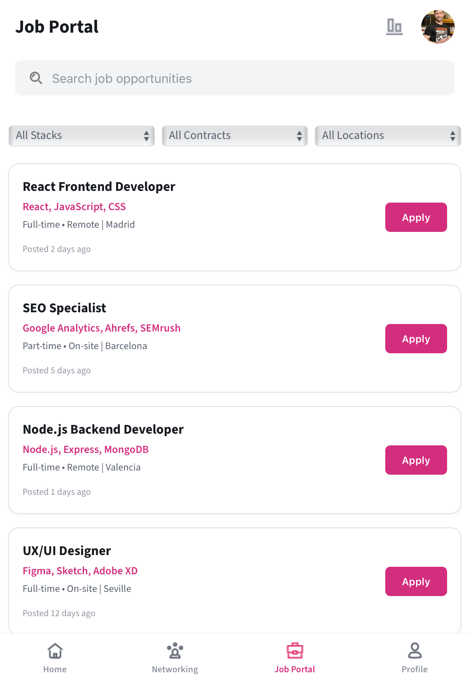

**Networking**  
Mobile-friendly networking and user discovery.

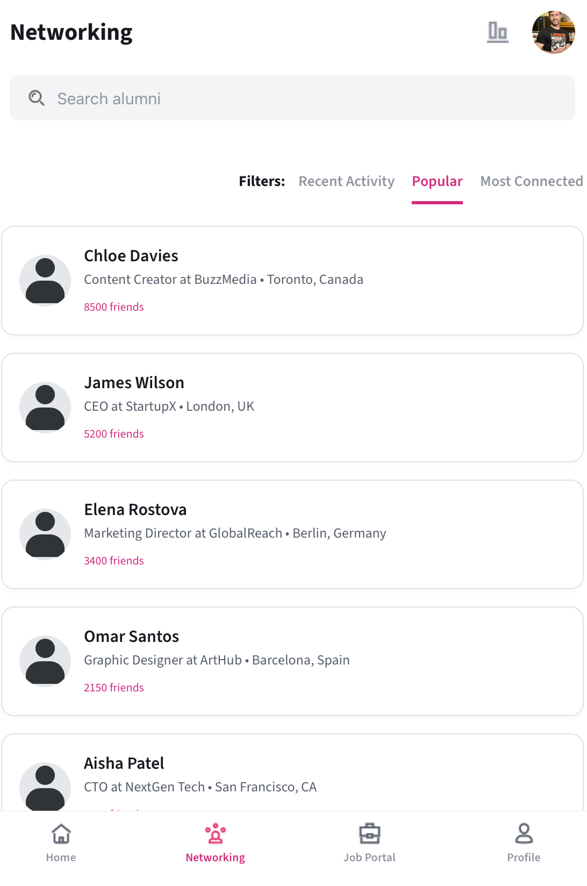

**User Profile**  
User profile viewing and management on mobile.

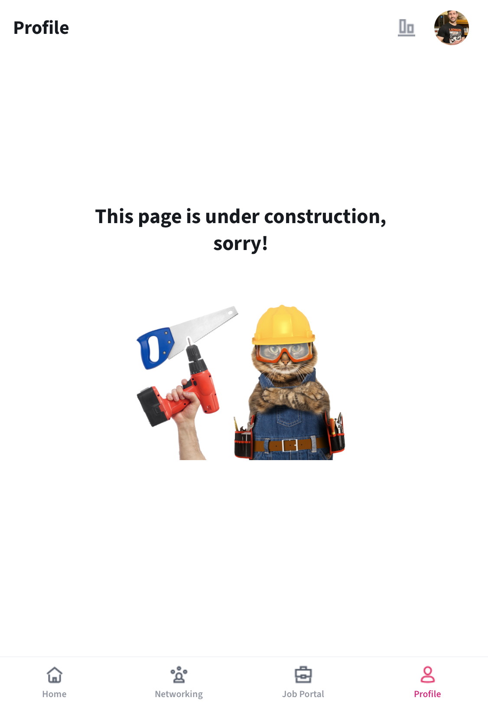

**Login Page**  
Mobile login interface.

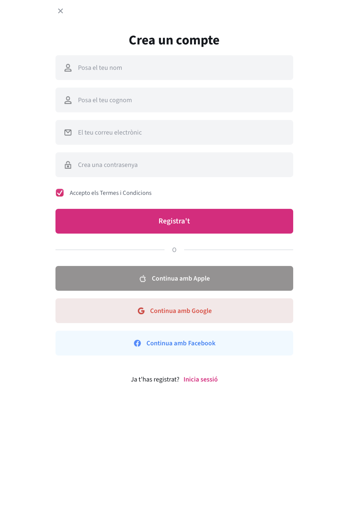

## License & Credits
Developed by:
- Albert Muntal Perez
- Linkedin: https://www.linkedin.com/in/albert-muntal-perez-a626a0120/
- GitHub: https://github.com/DrMunty
